# SSH Hardening: Medidas de Seguridad contra Ataques de Fuerza Bruta


## Descripción del Proyecto
Proyecto de **Administración de Sistemas y Ciberseguridad** enfocado en la auditoría y endurecimiento del protocolo SSH contra vulnerabilidades críticas.

El proyecto documenta el análisis completo de un servicio SSH sin proteger, la ejecución de un ataque de fuerza bruta exitoso y la implementación de múltiples capas de seguridad para mitigar riesgos.

---

## Características Principales
- **Auditoría de Vulnerabilidades**: Reconocimiento con nmap y análisis de servicios expuestos.
- **Ataque de Fuerza Bruta**: Implementación de hydra para compromiso exitoso de credenciales.
- **Hardening SSH**:
  - Cambio de puerto (22 → 2222)
  - Deshabilitar acceso root
  - Autenticación basada en clave pública
  - Desactivar autenticación por contraseña
- **Protección contra Brute Force**: Instalación y configuración de fail2ban (máx 3 intentos, 5 min ban).
- **Análisis Forense**: Revisión de logs de autenticación y detección de intentos maliciosos.

---

## PARTE 1: Atacando el Servicio SSH

### Reconocimiento con nmap
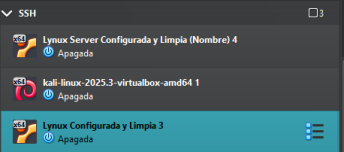

Se realiza un escaneo de puertos para identificar el servicio SSH:
```bash
nmap -sS -sV -p 22 IP_SERVER
```

**Resultados clave:**
- Host activo (UP)
- Puerto 22/tcp abierto
- Servicio: OpenSSH 9.6p1 Ubuntu
- Latencia: 0.00049s

### Creación de Usuario de Prueba
Se crea el usuario `gato` con contraseña `miau` para las pruebas de ataque.

### Intento de Acceso Manual
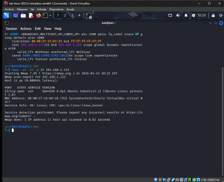

Se realizan intentos de acceso con contraseñas no autorizadas para evaluar respuestas del sistema.

### Ataque de Fuerza Bruta con Hydra
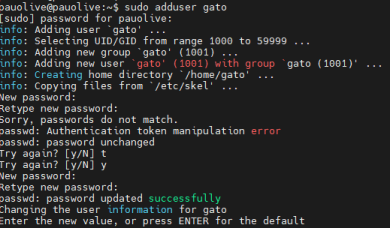

Usando la herramienta hydra se ejecuta un ataque de fuerza bruta:
```bash
hydra -l gato -P passwords_comunes.txt ssh://IP_SERVER -t 4
```

**Resultado:** Compromiso exitoso de credenciales en menos de 5 intentos.

### Acceso Post-Exploración
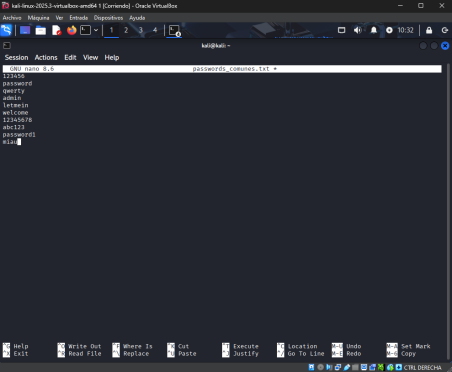

Se establece conexión remota al servidor comprometido.

### Análisis de Logs
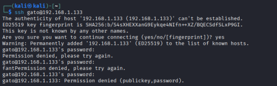

En `/var/log/auth.log` se registran todos los intentos fallidos:
- Timestamp exacto de intentos
- Dirección IP del atacante
- Usuario objetivo
- Contraseñas probadas (en logs detallados)

---

## PARTE 2: Implementación de Medidas de Seguridad

### 1. Cambio de Puerto SSH (22 → 2222)
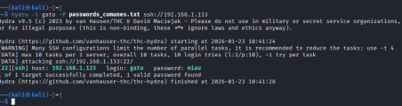

En `/etc/ssh/sshd_config`:
```bash
Port 2222
```

Reiniciar servicio:
```bash
sudo systemctl restart ssh
```

**Resultado:** Conexiones al puerto 22 rechazadas automáticamente.

### 2. Deshabilitar Acceso root
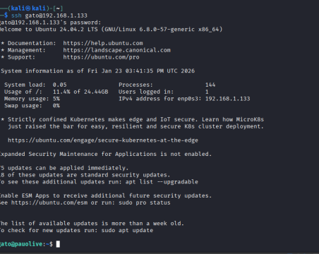

En `sshd_config`:
```bash
PermitRootLogin no
```

**Impacto:** El usuario root no puede conectarse remotamente vía SSH, incluso con contraseña correcta.

### 3. Instalación de fail2ban
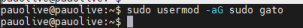

```bash
sudo apt install fail2ban
```

### 4. Configuración de fail2ban
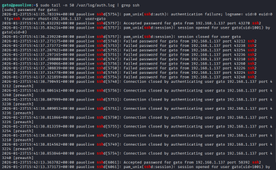

En `/etc/fail2ban/jail.local`:
```ini
[sshd]
enabled = true
maxretry = 3
bantime = 300
findtime = 600
```

- **maxretry**: 3 intentos antes de banear
- **bantime**: 300 segundos (5 minutos)
- **findtime**: Ventana de detección de 600 segundos (10 minutos)

### 5. Prueba de Ban Automático
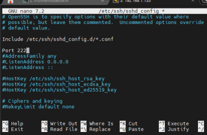

Tras 3 intentos fallidos de login, la IP es baneada y rechaza nuevas conexiones con `Connection refused`.

### 6. Autenticación por Clave Pública (Ubuntu Cliente)
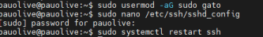

En la máquina Ubuntu cliente:
```bash
ssh-keygen -t rsa -b 4096 -f ~/.ssh/id_rsa -N ""
```

### 7. Copia de Clave Pública al Servidor
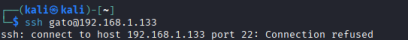

```bash
ssh-copy-id -i ~/.ssh/id_rsa.pub gato@SERVER -p 2222
```

La clave pública se almacena en `~/.ssh/authorized_keys` en el servidor.

### 8. Desactivar Autenticación por Contraseña
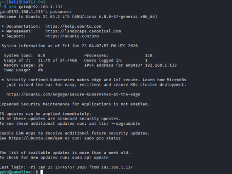

En `sshd_config`:
```bash
PasswordAuthentication no
PubkeyAuthentication yes
```

**Resultado:** Solo se acepta autenticación por clave pública.

### 9. Verificación Post-Hardening
- Acceso desde Ubuntu Cliente: ✅ Exitoso (clave pública)
- Acceso desde Kali Linux: ❌ Rechazado (sin clave pública + IP baneada)
- Acceso root: ❌ Bloqueado en todos los casos

---

## Análisis de Logs Finales
Revisión completa de `/var/log/auth.log` mostrando:
- Intentos fallidos iniciales
- Ataque de hydra y sus registros
- Modificaciones de configuración SSH
- Bans de fail2ban
- Transición a autenticación por clave
- Rechazo definitivo de métodos inseguros

---

## Conclusiones

La implementación de estas medidas reduce significativamente la superficie de ataque:

1. **Cambio de puerto**: Evita escaneos automatizados en puerto estándar
2. **fail2ban**: Previene ataques de fuerza bruta efectivamente
3. **Clave pública**: Elimina vulnerabilidad a diccionarios de contraseñas
4. **Desactivar root**: Reduce atacantes potenciales
5. **Logs monitoreados**: Permite detección temprana de amenazas

**Resultado final:** Servicio SSH endurecido conforme a mejores prácticas de ciberseguridad.

---

**Alumno:** Pau Olivé Moreno  
**Centro:** CEV (Centro de Estudios)  
**Ciclo:** ASIX (Administración de Sistemas Informáticos en Red) + Ciberseguridad  
**Actividad Evaluada:** Hardening SSH contra Ataques de Fuerza Bruta  

